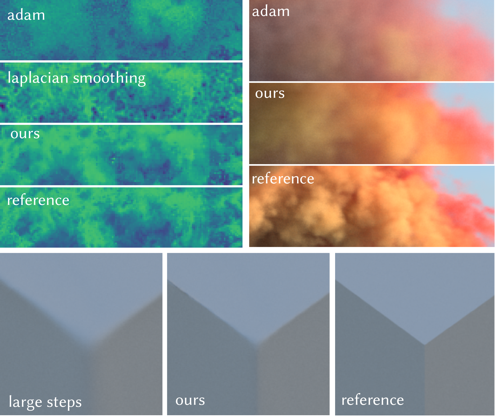

# Spatiotemporal Bilateral Gradient Filtering for Inverse Rendering



This repository contains the implementation for the SIGGRAPH Asia 2024 paper [Spatiotemporal Bilateral Gradient Filtering for Inverse Rendering
](https://weschang.com/publications/stadam/).

## Running

The code requires Python 3.10 and above and installing required dependencies by:

```shell
pip install -r requirements.txt
```

Then you should be able to run each notebook in the `notebooks` directory (either as jupyter notebooks or as python scripts).


## Important Files

- `notebooks/texture_run.py`: End-to-end texture optimization.
- `notebooks/volume_run.py`: End-to-end volume optimization.
- `notebooks/mesh_run.py`: End-to-end mesh optimization.
- `optimizers/filter_*.slang`: Slang filter implementations.
- `optimizers/spatiotemporal_adam*.py`: Our spatiotemporal optimizers.


## Citation


```bibtex
@inproceedings{WXY2024Stadam,
  title = {Spatiotemporal Bilateral Gradient Filtering for Inverse Rendering},
  author = {Chang, Wesley and Yang, Xuanda and Belhe, Yash and Ramamoorthi, Ravi and Li, Tzu-Mao},
  booktitle = {ACM SIGGRAPH Asia 2024 Conference Proceedings},
  articleno = {70},
  numpages = {11},
  year = {2024},
  publisher = {Association for Computing Machinery},
  address = {New York, NY, USA},
  location = {Tokyo, Japan},
  series = {SIGGRAPH Asia '24},
  url = {https://doi.org/10.1145/3680528.3687606},
  doi = {10.1145/3680528.3687606}
}
```

## Acknowledgement

The code examples adapted the following scenes:

- At the Window, from Bernhard Vogl.
- Autumn Field, from Jarod Guest and Sergej Majboroda.
- High-Res Smoke Plume, from JangaFX.
- Kloppenheim 06, from Greg Zaal
